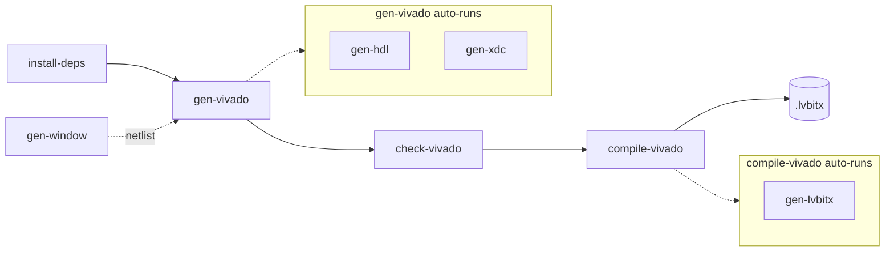

# Command Reference

Complete reference for the `nihdl` command-line surface. For the conceptual
background on how these commands fit together, see
[Theory of Operation](TheoryOfOperation.md). For how to configure them, see the
[Settings Reference](SettingsReference.md).

The current CLI surface is defined in `labview_fpga_hdl_tools/__main__.py`.

All commands require a `nihdlsettings.py` file in the current directory (or one
specified via `--config`). Run any command with `--help` for its options, and
`nihdl --help` for the full grouped command list.

## Output and Verbosity

By default, `nihdl` keeps the console quiet: it prints only **results**
(pass/fail and completion lines), **warnings**, and **errors**. Step-by-step
status is suppressed so that important messages are not lost in a stream of
progress output.

Use `-v` / `--verbose` to see the full detailed status. The flag works in either
position:

```bash
nihdl -v compile-vivado      # global position
nihdl compile-vivado -v      # after the command
```

Regardless of verbosity, every warning and error is **captured and reprinted as
a grouped summary at the end of the command**, on `stderr`. So even a noisy
verbose run ends with a clean list of everything that went wrong (or nothing, if
the run was clean). Because results go to `stdout` and warnings/errors go to
`stderr`, you can separate them, for example:

```bash
nihdl compile-vivado 2> errors.log
```

`-v` / `--verbose` is available on every command, alongside `--config` and
`--set KEY=VALUE`.

## Command Flow

Most commands chain into a build flow. Some commands run others automatically:



- `gen-vivado` automatically runs `gen-hdl` and `gen-xdc`.
- `compile-vivado` automatically runs `gen-lvbitx`.
- `gen-window` is only needed for hybrid LabVIEW + HDL flows; its output feeds `gen-vivado`.

## Commands

### Workspace Setup

| Command | Purpose | Options |
| --- | --- | --- |
| install-deps | Install GitHub dependencies from dependencies.toml. | --delete, --pre, --latest, --config |

### Vivado

| Command | Purpose | Options |
| --- | --- | --- |
| gen-vivado | Create or update the Vivado project from settings + file lists. | --overwrite (-o), --update (-u), --config |
| launch-vivado | Launch the configured Vivado project. | --config |
| check-vivado | Run Vivado RTL elaboration syntax/hierarchy check. | --config |
| compile-vivado | Run Vivado compile flow to bitstream generation. | --config |

### HDL Tools

| Command | Purpose | Options |
| --- | --- | --- |
| gen-window | Extract TheWindow netlist/support files from a Vivado Project Export. | --config |
| gen-hdl | Generate Window VHDL outputs only (automatically run in gen-vivado). | --config |
| gen-xdc | Generate XDC files from constraint templates/macros (automatically run in gen-vivado). | --config |
| gen-lvbitx | Build a .lvbitx from Vivado implementation output (automatically run in compile-vivado). | --config |

### LabVIEW FPGA Target

| Command | Purpose | Options |
| --- | --- | --- |
| gen-guid | Generate a new GUID for LVTargetGUID. | --config |
| gen-target | Generate full LabVIEW FPGA target support outputs (XML, VHDL stubs, plugin content). | --config |
| install-target | Install generated LabVIEW FPGA target plugin files. | --config |

### ModelSim

| Command | Purpose | Options |
| --- | --- | --- |
| gen-modelsim | Create a ModelSim project for HDL simulation. | --overwrite (-o), --config |
| launch-modelsim | Launch ModelSim with the current project. | --batch, --config |
| sim-modelsim | Run a ModelSim simulation with a custom .do file. | --do-file, --config |

### CLIP Migration

| Command | Purpose | Options |
| --- | --- | --- |
| migrate-clip | Migrate CLIP assets into top-level HDL workflow artifacts. | --config |

## Common Command Notes

- All commands require `nihdlsettings.py` in the current directory (or specified via `--config`).
- By default only results, warnings, and errors are shown; pass `-v`/`--verbose` for detailed status. Warnings and errors are always summarized at the end (see [Output and Verbosity](#output-and-verbosity)).
- Use `set_skip_vivado(True)` / `set_skip_modelsim(True)` in `nihdlsettings.py` to validate settings without launching external tools.
- install-deps and gen-guid do not need most settings (but still require `nihdlsettings.py`).
- install-deps treats a pre-release specifier in dependencies.toml (for example, ~=26.2.0.dev0) as opting that dependency into pre-release matching even without global --pre.
- gen-lvbitx is intended to run from VivadoProject/&lt;project&gt;.runs/impl_1 (it warns if run elsewhere).
- gen-lvbitx locates createBitfile.exe from the LabVIEW install. By default it auto-discovers the latest installed LabVIEW (2023–2030) under Program Files; set `set_labview_path` in `nihdlsettings.py` to override (for example, "C:\Program Files\National Instruments\LabVIEW 2023").
- gen-modelsim uses vcom -autoorder -2008 to compile all VHDL files in a single invocation with automatic dependency resolution. No manual compile-order file is needed.
- launch-modelsim defaults to GUI mode; use --batch for headless simulation.

## Per-Command Setting Requirements

The required settings below are validated before each command runs. See the
[Settings Reference](SettingsReference.md) for the setter that configures each
one.

| Command | Required Settings (normal run) | Notes |
| --- | --- | --- |
| install-deps | `dependencies` | Does not use other settings. |
| gen-vivado | `vivado_project_folder`, `top_level_entity`, `fpga_part`, `hdl_file_lists` | Non-skip adds `vivado_tools_folder`. If `lv_window_netlist_folder` is set, Window files are integrated. |
| launch-vivado | `vivado_tools_folder`, `vivado_project_folder` | Also requires an existing project .xpr file. |
| check-vivado | `vivado_project_folder`, `top_level_entity`, `fpga_part`, `vivado_tcl_scripts_folder` | Non-skip adds `vivado_tools_folder` and an existing project .xpr file. |
| compile-vivado | `vivado_project_folder`, `vivado_tcl_scripts_folder` | Non-skip adds `vivado_tools_folder` and an existing project .xpr file. |
| gen-window | `lv_window_vivado_project_export_xpr`, `lv_window_netlist_output_folder`, `vivado_tools_folder` | When skip_vivado is set, Vivado is not launched. |
| gen-hdl | `generated_vhdl_templates`, `generated_vhdl_output_folder` | `custom_io_csv` ([reference](LVTargetCustomIO-Reference.md)) required when include_custom_io_on_lv_window=True. |
| gen-xdc | None enforced by a dedicated validator | For useful output, set `constraints_templates`. |
| gen-lvbitx | `top_level_entity` | Locates createBitfile.exe from `labview_path` when set, otherwise auto-discovers the latest installed LabVIEW (2023–2030) under Program Files. Uses `top_level_entity` to derive filenames. |
| gen-guid | None | Does not use any settings. |
| gen-target | `target_family`, `base_target`, `generated_vhdl_templates`, `generated_vhdl_output_folder`, `lv_target_plugin_output_folder`, `lv_target_name`, `lv_target_guid`, `boardio_output`, `clock_output`, `lv_target_xml_templates`, `hdl_file_lists` | `custom_io_csv` ([reference](LVTargetCustomIO-Reference.md)) required when include_custom_io_on_lv_window=True. |
| install-target | `lv_target_install_folder`, `lv_target_name`, `lv_target_plugin_output_folder` | Install folder and plugin folder must exist. |
| gen-modelsim | `top_level_entity`, `hdl_file_lists`, `modelsim_tools_folder` | Uses `modelsim_file_lists` if set, otherwise `hdl_file_lists`. |
| launch-modelsim | `top_level_entity`, `modelsim_tools_folder` | Requires existing ModelSim project directory (run gen-modelsim first). |
| sim-modelsim | `top_level_entity`, `modelsim_tools_folder` | Requires existing ModelSim project directory. |
| migrate-clip | `clip_input_xml`, `clip_output_csv`, `clip_top_hdl`, `clip_inst_example`, `clip_to_window_signal_definitions` | If `clip_constraints` is set, `clip_entity_path` and `clip_output_xdc_folder` are also required. |

## Example Usage

```bash
# Create or refresh Vivado project
nihdl gen-vivado --overwrite

# Fast RTL syntax/hierarchy check
nihdl check-vivado

# Full compile to bitstream
nihdl compile-vivado

# Generate custom target support artifacts
nihdl gen-target

# Create ModelSim project and compile all VHDL
nihdl gen-modelsim

# Launch ModelSim GUI
nihdl launch-modelsim

# Run ModelSim simulation headless
nihdl launch-modelsim --batch

# Install dependencies from dependencies.toml
nihdl install-deps
```

To validate settings without launching external tools, add this to your `nihdlsettings.py`:

```python
def pre_all(context):
    config = context.config
    # ... configure settings ...
    config.set_skip_vivado(True)
    config.set_skip_modelsim(True)
```
