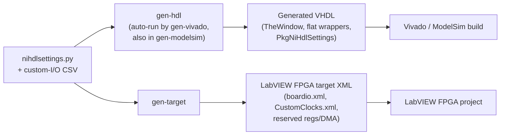

# Generated VHDL

The `nihdl` tools **generate** some of a target's VHDL rather than asking you to
hand-write it. This document explains *what* gets generated, *why* it is generated
instead of authored by hand, and *how* it plugs into the two
[compile flows](TheoryOfOperation.md#the-two-compile-flows).

For the operational details of each piece, this page links out to the two
reference documents that cover the mechanics in depth:

- [LVTargetBoardIO.csv Reference](LVTargetCustomIO-Reference.md) — the custom-I/O
  CSV that drives the Window VHDL and the LabVIEW FPGA resource XML.
- [The Window Netlist and Constraints Processing](WindowNetlistAndConstraints.md) —
  why the window is a Verilog netlist and needs the flatten/unflatten wrappers.

## The core idea: single-sourcing

The reason the tools generate VHDL is **single-sourcing**. A custom target has a
few facts — its custom I/O signals, how many HDL FIFOs it reserves, how much
register space the HDL uses — that must be described in **two** places at once:

- in the **HDL**, so the top-level design instantiates the right ports and the
  `UserHdl` block can self-check its limits, and
- in the **LabVIEW FPGA target plugin's resource XML**, so LabVIEW FPGA presents
  the matching I/O, clocks, registers, and DMA channels in the project.

If you maintained both by hand they would inevitably drift, and a mismatch between
the HDL and the LabVIEW-generated window is exactly the kind of bug that is painful
to find. Instead, each fact is written **once** — in `nihdlsettings.py` (and the
[custom-I/O CSV](LVTargetCustomIO-Reference.md)) — and the tools generate **both**
the VHDL and the resource XML from that single source, so they can never disagree.

## How generation is configured

Generated VHDL templates are ordinary [Mako](https://www.makotemplates.org/)
templates registered in `nihdlsettings.py`:

```python
# --- Generated VHDL - shared by the Vivado and LabVIEW FPGA compile flows ---
config.add_generated_vhdl_template(f"{base_deps}/rtl-lvfpga/lvgen/TheWindow.vhd.mako")
config.add_generated_vhdl_template("rtl-lvfpga/TheLvWindowFlatWrapper.vhd.mako")
config.add_generated_vhdl_template("rtl-lvfpga/PkgTheLvWindowFlatWrapper.vhd.mako")
config.add_generated_vhdl_template("../common/rtl-lvfpga/PkgNiHdlSettings.vhd.mako")
config.set_generated_vhdl_output_folder("objects/GeneratedHDL")
```

- Each template is rendered to `set_generated_vhdl_output_folder`, using the
  template's basename minus the `.mako` suffix (so `TheWindow.vhd.mako` →
  `TheWindow.vhd`).
- The output folder lives under `objects/`, which is **not** checked in — the
  files are reproducible build artifacts. You add the generated `.vhd` files to
  your `vivadoprojectsources.txt` / `modelsimprojectsources.txt` file lists so the
  build picks them up.
- Rendering is done by `nihdl gen-hdl`. You rarely call it directly:
  [`gen-vivado` runs `gen-hdl` automatically](CommandReference.md#command-flow),
  and `gen-modelsim` renders the same templates so simulation and synthesis stay
  in lock-step.

## What gets generated (and why)

There are two categories of generated VHDL. Both exist for the single-sourcing
reason above; they just single-source *different* facts.

### 1. Window VHDL — matching the LabVIEW-generated window

**Files:** `TheWindow.vhd`, `TheLvWindowFlatWrapper.vhd`,
`PkgTheLvWindowFlatWrapper.vhd`
**Single source:** the [custom-I/O CSV](LVTargetCustomIO-Reference.md)
(`set_custom_io_csv`).

The "window" is the LabVIEW FPGA VI portion of the design. LabVIEW FPGA generates
the window's VHDL during its own code generation, so the **top-level HDL
instantiation must match that generated window exactly**. To guarantee the match,
the tools generate the top-level's view of the window from the same custom-I/O CSV
that describes the signals, producing two kinds of output:

- **Resource XML for the LabVIEW FPGA target plugin** (`boardio.xml`,
  `CustomClocks.xml`) — this is what places the custom I/O and clocks in the
  LabVIEW FPGA project so they can be used on the VI block diagram.
- **`TheWindow` VHDL instantiation and its wrappers** for use in the top-level
  VHDL. The wrappers exist because the window is brought in as a **Verilog
  netlist**, and Verilog cannot carry the VHDL **record** ports on the window
  boundary. `TheLvWindowFlatWrapper` **flattens** the record ports down to
  `std_logic_vector` going into the window and **unflattens** them coming back out.

See [LVTargetBoardIO.csv Reference](LVTargetCustomIO-Reference.md) for the CSV
columns and the exact XML/VHDL each one produces, and
[The Window Netlist and Constraints Processing](WindowNetlistAndConstraints.md) for
why the netlist is Verilog and how the flat wrapper is structured.

### 2. `PkgNiHdlSettings.vhd` — HDL constants from `nihdlsettings.py`

**File:** `PkgNiHdlSettings.vhd` (from the shared
`../common/rtl-lvfpga/PkgNiHdlSettings.vhd.mako` template used by every target)
**Single source:** scalar settings in `nihdlsettings.py`.

`PkgNiHdlSettings.vhd` is a small generated VHDL package that exposes a few
`nihdlsettings.py` values to the HDL as constants, so the `UserHdl` block can
self-check them during elaboration (both synthesis and simulation). The **same**
settings also feed the LabVIEW FPGA target plugin's resource XML — that is the
single-sourcing in action:

| `nihdlsettings.py` setting | Generated HDL constant (`PkgNiHdlSettings.vhd`) | LabVIEW FPGA target XML |
| --- | --- | --- |
| `set_max_hdl_reg_offset(n)` | `kMaxHdlRegOffset` | `min_lv_reg_offset` = `n + 4` (first register LabVIEW FPGA may use, after the HDL registers) |
| `set_num_hdl_fifos(n)` | `kNumHdlFifos` | `num_reserved_dma_stream_channel_ids` = fixed-logic DMA streams **+ n** |
| *(derived from `set_target_family`)* | `kNumFixedLogicDmaStreams` | (used with `num_hdl_fifos` above) |

Because both the HDL constant and the XML field come from one setting, the HDL and
the LabVIEW FPGA target can never disagree about how much register space or how
many DMA channels the user HDL owns. Change the number of FIFOs in one place —
`nihdlsettings.py` — and both the HDL and the target plugin update on the next
`gen-vivado` / `gen-target`.

> **Generated — do not edit.** Every file under the generated-VHDL output folder is
> overwritten on the next run. Change the source (`nihdlsettings.py` or the
> custom-I/O CSV), not the generated `.vhd`.

## Where this fits in the flow



See the [Command Reference](CommandReference.md) for exactly which commands render
the templates and the [Settings Reference](SettingsReference.md) for every setter
involved.
