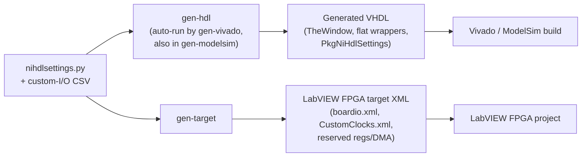

# Generated VHDL

The `nihdl` tools **generate** some of a target's VHDL rather than asking you to
hand-write it. This document explains *what* gets generated, *why* it is generated
instead of authored by hand, and *how* it plugs into the two
[compile flows](TheoryOfOperation.md#the-two-compile-flows).

For the operational details of each piece, this page links out to the two
reference documents that cover the mechanics in depth:

- [LVTargetBoardIO.csv Reference](LVTargetCustomIO-Reference.md) — the custom-I/O
  CSV that drives the Window VHDL and the LabVIEW FPGA resource XML.
- [The Window Netlist and Constraints Processing](WindowNetlistAndConstraints.md) —
  why the window is a Verilog netlist and needs the flatten/unflatten wrappers.

## The core idea: single-sourcing

The reason the tools generate VHDL is **single-sourcing**. A custom target has a
few facts — its custom I/O signals, how many HDL FIFOs it reserves, how much
register space the HDL uses — that must be described in **two** places at once:

- in the **HDL**, so the top-level design instantiates the right ports and the
  `UserHdl` block can self-check its limits, and
- in the **LabVIEW FPGA target plugin's resource XML**, so LabVIEW FPGA presents
  the matching I/O, clocks, registers, and DMA channels in the project.

If you maintained both by hand they would inevitably drift, and a mismatch between
the HDL and the LabVIEW-generated window is exactly the kind of bug that is painful
to find. Instead, each fact is written **once** — in `nihdlsettings.py` (and the
[custom-I/O CSV](LVTargetCustomIO-Reference.md)) — and the tools generate **both**
the VHDL and the resource XML from that single source, so they can never disagree.

## How generation is configured

Generated VHDL templates are ordinary [Mako](https://www.makotemplates.org/)
templates registered in `nihdlsettings.py`:

```python
# --- Generated VHDL - shared by the Vivado and LabVIEW FPGA compile flows ---
config.add_generated_vhdl_template(f"{base_deps}/rtl-lvfpga/lvgen/TheWindow.vhd.mako")
config.add_generated_vhdl_template("rtl-lvfpga/TheLvWindowFlatWrapper.vhd.mako")
config.add_generated_vhdl_template("rtl-lvfpga/PkgTheLvWindowFlatWrapper.vhd.mako")
config.add_generated_vhdl_template("../common/rtl-lvfpga/PkgNiHdlSettings.vhd.mako")
config.set_generated_vhdl_output_folder("objects/GeneratedHDL")
```

- Each template is rendered to `set_generated_vhdl_output_folder`, using the
  template's basename minus the `.mako` suffix (so `TheWindow.vhd.mako` →
  `TheWindow.vhd`).
- The output folder lives under `objects/`, which is **not** checked in — the
  files are reproducible build artifacts. You add the generated `.vhd` files to
  your `vivadoprojectsources.txt` / `modelsimprojectsources.txt` file lists so the
  build picks them up.
- Rendering is done by `nihdl gen-hdl`. You rarely call it directly:
  [`gen-vivado` runs `gen-hdl` automatically](CommandReference.md#command-flow),
  and `gen-modelsim` renders the same templates so simulation and synthesis stay
  in lock-step.

## What gets generated (and why)

There are two categories of generated VHDL. Both exist for the single-sourcing
reason above; they just single-source *different* facts.

### 1. Window VHDL — matching the LabVIEW-generated window

**Files:** `TheWindow.vhd`, `TheLvWindowFlatWrapper.vhd`,
`PkgTheLvWindowFlatWrapper.vhd`
**Single source:** the [custom-I/O CSV](LVTargetCustomIO-Reference.md)
(`set_custom_io_csv`).

The "window" is the LabVIEW FPGA VI portion of the design. LabVIEW FPGA generates
the window's VHDL during its own code generation, so the **top-level HDL
instantiation must match that generated window exactly**. To guarantee the match,
the tools generate the top-level's view of the window from the same custom-I/O CSV
that describes the signals, producing two kinds of output:

- **Resource XML for the LabVIEW FPGA target plugin** (`boardio.xml`,
  `CustomClocks.xml`) — this is what places the custom I/O and clocks in the
  LabVIEW FPGA project so they can be used on the VI block diagram.
- **`TheWindow` VHDL instantiation and its wrappers** for use in the top-level
  VHDL. The wrappers exist because the window is brought in as a **Verilog
  netlist**, and Verilog cannot carry the VHDL **record** ports on the window
  boundary. `TheLvWindowFlatWrapper` **flattens** the record ports down to
  `std_logic_vector` going into the window and **unflattens** them coming back out.

See [LVTargetBoardIO.csv Reference](LVTargetCustomIO-Reference.md) for the CSV
columns and the exact XML/VHDL each one produces, and
[The Window Netlist and Constraints Processing](WindowNetlistAndConstraints.md) for
why the netlist is Verilog and how the flat wrapper is structured.

### 2. `PkgNiHdlSettings.vhd` — HDL constants from `nihdlsettings.py`

**File:** `PkgNiHdlSettings.vhd` (from the shared
`../common/rtl-lvfpga/PkgNiHdlSettings.vhd.mako` template used by every target)
**Single source:** scalar settings in `nihdlsettings.py`.

`PkgNiHdlSettings.vhd` is a small generated VHDL package that exposes a few
`nihdlsettings.py` values to the HDL as constants, so the `UserHdl` block can
self-check them during elaboration (both synthesis and simulation). The **same**
settings also feed the LabVIEW FPGA target plugin's resource XML — that is the
single-sourcing in action:

| `nihdlsettings.py` setting | Generated HDL constant (`PkgNiHdlSettings.vhd`) | LabVIEW FPGA target XML |
| --- | --- | --- |
| `set_max_hdl_reg_offset(n)` | `kMaxHdlRegOffset` | `min_lv_reg_offset` = `n + 4` (first register LabVIEW FPGA may use, after the HDL registers) |
| `set_num_hdl_fifos(n)` | `kNumHdlFifos` | `num_reserved_dma_stream_channel_ids` = fixed-logic DMA streams **+ n** |
| *(derived from `set_target_family`)* | `kNumFixedLogicDmaStreams` | (used with `num_hdl_fifos` above) |

Because both the HDL constant and the XML field come from one setting, the HDL and
the LabVIEW FPGA target can never disagree about how much register space or how
many DMA channels the user HDL owns. Change the number of FIFOs in one place —
`nihdlsettings.py` — and both the HDL and the target plugin update on the next
`gen-vivado` / `gen-target`.

The two sections below explain what these numbers *mean* — how the register
address space and the DMA stream channels are split between the user HDL and
LabVIEW FPGA.

> **Generated — do not edit.** Every file under the generated-VHDL output folder is
> overwritten on the next run. Change the source (`nihdlsettings.py` or the
> custom-I/O CSV), not the generated `.vhd`.

## How HDL registers share the LabVIEW FPGA register space

Host registers live on the **RegPort** bus — a 32-bit, word-addressed register
space that the host reads and writes through the NI-RIO driver. That one space is
**shared** between your HDL registers and the LabVIEW FPGA VI's controls and
indicators that sit on the RegPort register bus. `set_max_hdl_reg_offset` is how the
two are kept from colliding, and it is the reason `kMaxHdlRegOffset` /
`min_lv_reg_offset` are single-sourced.

- **HDL registers are allocated from the bottom of the register space, growing
  upward.** On today's targets the LabVIEW FPGA window's register space starts at
  byte offset `0`, so the HDL registers simply start at `0` and increment. The
  register offset map isn't complicated on its own — it's just this bottom-up
  allocation, and the fact that HDL takes the low offsets first.
- **`set_max_hdl_reg_offset(n)` is the HDL's budget — a ceiling, not a base.** The
  generated `kMaxHdlRegOffset` constant is asserted inside `UserHdl` at elaboration,
  so a design whose register block overruns `n` **fails to build** (in both the
  Vivado and ModelSim flows) instead of silently spilling into LabVIEW FPGA's
  registers.
- **That same `n` becomes LabVIEW FPGA's lower bound.** The tools write
  `min_lv_reg_offset = n + 4` (the next 32-bit register) into the target resource
  XML, so LabVIEW FPGA places its controls/indicators **just above** the HDL
  registers.

In other words, **the HDL eats into the shared register space first, bottom-up, and
whatever it leaves is LabVIEW FPGA's.** Because the HDL ceiling and the LabVIEW FPGA
floor come from the *same* setting, growing the HDL register block automatically
pushes the LabVIEW FPGA registers up — they can never overlap.

```text
 byte offset
   high  ┌────────────────────────────┐
         │  LabVIEW FPGA controls /    │  starts at min_lv_reg_offset = n + 4
         │  indicators (RegPort)       │
         ├────────────────────────────┤  ← n = set_max_hdl_reg_offset (HDL ceiling)
         │  user HDL registers         │
   0x00  └────────────────────────────┘  HDL grows up from the bottom
```

> **Non-zero register bases.** Every target today starts its LabVIEW FPGA register
> space at offset `0`, which is why HDL registers start at `0`. If a future target
> started that space at a non-zero offset, the host-side NI-RIO register API would
> absorb the base so that, from the host's point of view, the user HDL registers
> still appear to start at `0`.

For the RegPort bus protocol itself (the read/write handshake), see the
[hdl-shared RegPort Theory of Operation](https://github.com/ni/hdl-shared/blob/main/host_interfaces/register/docs/RegPort_Theory_of_Operation.md).

## How HDL FIFOs share the DMA stream channels

DMA FIFOs work like the [registers above](#how-hdl-registers-share-the-labview-fpga-register-space):
the target has a fixed number of **DMA stream channels**, and the user HDL FIFOs
and the LabVIEW FPGA VI carve them out of that one pool. The indexing is the fiddly
part, so this section follows it end to end.

### The three regions of the channel range

`kNumberOfDmaChannels` — the target's total, from the LabVIEW window config
(`PkgCommIntConfiguration`) — is split three ways:

- **Fixed-logic streams** (the platform's own DMA) sit at the **top**, from
  `kNumberOfDmaChannels - 1` downward. Their count is a per-family constant in the
  tools (`kNumFixedLogicDmaStreams`, `4` for FlexRIO).
- **User HDL FIFOs** sit **just below** the fixed logic, growing **downward**.
- **LabVIEW FPGA FIFOs** get whatever is left, from index **0 upward**.

```text
 DMA stream index
   high  ┌────────────────────────────┐  kNumberOfDmaChannels - 1
         │  fixed-logic DMA streams    │  (kNumFixedLogicDmaStreams of them)
         ├────────────────────────────┤  ← kUserHdlDmaStartIndex
         │  user HDL FIFOs (downward)   │  (kNumHdlFifos of them)
         ├────────────────────────────┤
         │  LabVIEW FPGA FIFOs          │  (grow up from 0)
   0     └────────────────────────────┘
```

The first user HDL FIFO channel is a derived constant in `PkgUserHdl.vhd`, built
from the LabVIEW window's channel count and the generated `kNumFixedLogicDmaStreams`:

```vhdl
-- DERIVED - do not edit. Starting DMA channel index where the user HDL FIFOs
-- are inserted, growing downward ...
constant kUserHdlDmaStartIndex : natural :=
  kNumberOfDmaChannels - 1 - kNumFixedLogicDmaStreams;
```

So on a target with 64 channels and 4 fixed-logic streams,
`kUserHdlDmaStartIndex = 64 - 1 - 4 = 59`, and the user FIFOs take 59, 58, … downward.

### You index FIFOs from 0; the merge maps them to real channels

You declare your FIFOs in a **0-based** array in `PkgUserHdl.vhd` — index 0, 1, 2, …
(the array must have exactly `kNumHdlFifos` entries, or the package fails to analyze):

```vhdl
constant kUserHdlDmaFifoConf : UserDmaFifoConfArray_t(0 to kNumHdlFifos - 1) := (
  0 => (FifoDepth => 1029, DataType => kInteger32, ElementsPerClockCycle => 1, Mode => NiFpgaHostToTarget),
  1 => (FifoDepth => 1023, DataType => kInteger32, ElementsPerClockCycle => 1, Mode => NiFpgaTargetToHost)
);
```

That 0-based config index is mapped to a real DMA channel at the **top level**, where
`MergeDmaFifoConf` splices the user FIFOs into the platform's channel array (from
`kUserHdlDmaStartIndex` downward) and `GetForceChannelEnable` marks those channels
as used:

```vhdl
HostInterfacex: entity work.G3UsHostInterfaceIsoPort (struct)
  generic map (
    kDmaFifoConfArrayGeneric => MergeDmaFifoConf(kDmaFifoConfArray, kUserHdlDmaFifoConf,
                                                 kUserHdlDmaStartIndex),
    kForceChannelEnable      => GetForceChannelEnable(kUserHdlDmaFifoConf,
                                                      kUserHdlDmaStartIndex))
```

`MergeDmaFifoConf` (in hdl-shared's `PkgNiSharedFifo.vhd`) is what makes "config
index 0" mean "the top user channel":

```vhdl
--   UserConf(0) → Result(StartIndex)
--   UserConf(1) → Result(StartIndex - 1)
--   …
```

So config index `i` lands on DMA channel `kUserHdlDmaStartIndex - i`. In the example
above, config 0 (the Host→Target reader) is channel 59 and config 1 (the
Target→Host writer) is channel 58 — exactly how the top level wires the per-channel
stream ports into `UserHdl`:

```vhdl
-- Reader channel: conf(0) = HostToTarget at DMA index kUserHdlDmaStartIndex
dReaderInputStreamInterfaceToFifo => dInputStreamInterfaceToFifo(kUserHdlDmaStartIndex),
-- Writer channel: conf(1) = TargetToHost at DMA index kUserHdlDmaStartIndex - 1
dWriterInputStreamInterfaceToFifo => dInputStreamInterfaceToFifo(kUserHdlDmaStartIndex - 1),
```

(The `dInputStreamInterfaceToFifo(...)` / `dOutputStreamInterfaceToFifo(...)` arrays
are the DMA stream arrays that feed the top-level host-interface entity.)

### HDL FIFOs eat into LabVIEW FPGA's FIFOs

Just like registers, **every FIFO you use in HDL is one fewer the LabVIEW FPGA VI
can use.** When `gen-target` builds the custom target plugin it reserves the
fixed-logic streams **plus** one channel per user HDL FIFO, and writes that reserved
count into the resource XML:

```python
# gen_labview_target_plugin.py
num_reserved_dma_stream_channel_ids = num_fixed_logic_dma_streams + (
    num_hdl_fifos if num_hdl_fifos is not None else 0
)
```

with the fixed-logic base coming from the target family:

```python
# generate_vhdl.py
if target_family == "FlexRIO":
    return 4
```

So LabVIEW FPGA's usable DMA FIFOs = `kNumberOfDmaChannels -
num_reserved_dma_stream_channel_ids`. Add a FIFO in HDL (`set_num_hdl_fifos`), and
the HDL (`kNumHdlFifos`, `kUserHdlDmaStartIndex`) and the LabVIEW FPGA upper bound
move together — single-sourced, so they can't disagree.

> **Host-side indexing.** On the host you address a user HDL FIFO by its **0-based
> config index** (the same numbering you used in `kUserHdlDmaFifoConf`). The NI-RIO
> driver API translates that to the actual DMA stream number
> (`kUserHdlDmaStartIndex - i`) for you — the same trick the register API uses to keep
> user HDL looking like it starts at 0.

> **Aside — FIFO config registers.** Separately from the stream *index*, each user
> FIFO also has a block of DMA config registers whose base address is derived from the
> **config index** (not the channel), stepping down by `0x40` from `0x37FFC`
> (`DmaChannelBaseAddress` in `PkgNiSharedFifo.vhd`). That register address space is
> its own mapping — don't confuse it with the stream index above.

## Where this fits in the flow



See the [Command Reference](CommandReference.md) for exactly which commands render
the templates and the [Settings Reference](SettingsReference.md) for every setter
involved.
