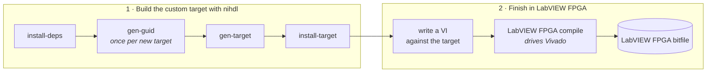

# LabVIEW FPGA Target and Compile Flow

This page pulls together the **LabVIEW FPGA compile flow**: you package your HDL as
a **custom LabVIEW FPGA target**, install it, and then finish the design **in
LabVIEW FPGA** — writing a VI against the target and letting LabVIEW FPGA compile
the bitfile (it invokes Vivado under the hood). Choose this when you want to combine
custom HDL with a LabVIEW FPGA VI and use the standard LabVIEW FPGA
bitfile-generation experience.

For the conceptual difference between this and the
[Vivado compile flow](VivadoCompileFlow.md), see
[Theory of Operation → The two compile flows](TheoryOfOperation.md#the-two-compile-flows).

> **LabVIEW version requirement.** This flow compiles the bitfile **in LabVIEW FPGA**, so it needs
> **LabVIEW 2026 or newer**.
> If you only need a LabVIEW *window netlist* to bring into the
> [Vivado compile flow](VivadoCompileFlow.md), LabVIEW 2023+ is fine. Details:
> [Window Netlist and Constraints → LabVIEW version support](WindowNetlistAndConstraints.md#labview-version-support-2023-vs-2026).

## The two stages

This flow has two stages. The `nihdl` tools own the **first**; LabVIEW FPGA owns the
**second**.



| Command | What it does |
| --- | --- |
| [`install-deps`](CommandReference.md#workspace-setup) | Clone the dependency repos named in `dependencies.toml` into `deps/`. |
| [`gen-guid`](CommandReference.md#labview-fpga-compile-flow) | Generate a fresh GUID for a **new** target; paste it into `set_lv_target_guid(...)`. Do this once so every custom target is uniquely identified. |
| [`gen-target`](CommandReference.md#labview-fpga-compile-flow) | Generate the full target-plugin content: the [resource XML](#the-custom-io-csv-single-source) (`boardio.xml`, `CustomClocks.xml`), the [generated VHDL](GeneratedVHDL.md), the processed target constraints, and the plugin folder. |
| [`install-target`](CommandReference.md#labview-fpga-compile-flow) | Copy the generated plugin into the LabVIEW FPGA targets folder so LabVIEW picks it up. |

## The custom-I/O CSV single source

The heart of a custom target is the
[`LVTargetBoardIO.csv`](LVTargetCustomIO-Reference.md) — it declares the signals
that bridge your HDL and the LabVIEW FPGA block diagram. `gen-target` reads it and
produces, from that one source:

- **`boardio.xml`** — the I/O resource hierarchy shown in the LabVIEW FPGA project.
- **`CustomClocks.xml`** — the user clock domains.
- **Window VHDL** — `TheWindow` plus its flatten/unflatten wrappers, so the
  top-level HDL matches the window LabVIEW FPGA generates.

Because both the HDL and the LabVIEW FPGA target come from the same CSV (and the
same `nihdlsettings.py` scalars), they cannot drift. See
[Generated VHDL](GeneratedVHDL.md) for the full single-sourcing story, and
[LVTargetBoardIO.csv Reference](LVTargetCustomIO-Reference.md) for the column
format. If you are porting an existing socketed CLIP, `nihdl migrate-clip` generates
a starter CSV for you.

## Settings

Configure these in the target's `nihdlsettings.py` (see the
[Settings Reference](SettingsReference.md) for every setter).

**Target identity and content**

| Setter | Purpose |
| --- | --- |
| `set_target_family(name)` / `set_base_target(name)` | The device family (for example `FlexRIO`) and base model (for example `PXIe-7912`). |
| `set_lv_target_name(name)` | Display name of the custom target. |
| `set_lv_target_guid(guid)` | Unique GUID from `gen-guid`. |
| `set_lv_target_install_folder(path)` | Where `install-target` copies the plugin. |
| `set_lv_target_plugin_output_folder(path)` | Where `gen-target` writes the plugin content. |
| `set_lv_target_menus_folder(path)` / `set_lv_target_info_ini(path)` | Menu assets and `TargetInfo.ini` source. |
| `add_lv_target_xml_template(path)` | Target resource XML Mako templates (`Resource.xml`, board-specific XML). |

**Custom I/O and the window**

| Setter | Purpose |
| --- | --- |
| `set_custom_io_csv(path)` | The [custom-I/O CSV](LVTargetCustomIO-Reference.md). |
| `set_boardio_output(path)` / `set_clock_output(path)` | Output paths for `boardio.xml` / `CustomClocks.xml`. |
| `add_generated_vhdl_template(path)` | Window VHDL + `PkgNiHdlSettings` templates. See [Generated VHDL](GeneratedVHDL.md). |
| `set_include_board_io_on_lv_window(flag)` / `set_include_custom_io_on_lv_window(flag)` | Whether standard board I/O and custom I/O appear on the window. |
| `set_entity_path_to_window(path)` / `set_entity_path_to_window_wrapper(path)` | HDL instance paths to the window and its flat wrapper (used for constraint scoping). |
| `set_max_hdl_reg_offset(n)` / `set_num_hdl_registers(n)` / `set_num_hdl_fifos(n)` | HDL register/FIFO limits — single-sourced into both the HDL and the target XML. See how the HDL and LabVIEW FPGA share the [register space](GeneratedVHDL.md#how-hdl-registers-share-the-labview-fpga-register-space) and the [DMA stream channels](GeneratedVHDL.md#how-hdl-fifos-share-the-dma-stream-channels). |

**Exclusions and constraints**

| Setter | Purpose |
| --- | --- |
| `add_lv_target_exclude_files(path)` | File lists naming sources LabVIEW FPGA supplies itself during code generation — excluded so the plugin does not ship duplicates that collide. |
| `add_lv_target_constraints(path)` | The processed target constraints (`objects/lv_target_xdc/constraints.xdc`) plus the base target's placement constraints. See [Window Netlist and Constraints](WindowNetlistAndConstraints.md). |

## Step by step

From the target folder:

```bash
# 1. Pull the dependency repos (first time / when versions change).
nihdl install-deps

# 2. For a brand-new target, mint a GUID and paste it into nihdlsettings.py.
nihdl gen-guid

# 3. Generate the custom LabVIEW FPGA target plugin.
nihdl gen-target

# 4. Close all LabVIEW instances, then install so LabVIEW FPGA can see it.
nihdl install-target
```

> **Close LabVIEW around `install-target`.** LabVIEW FPGA only scans for target plugins **at
> startup**. Close **all** open LabVIEW instances before running `install-target`, then start
> LabVIEW afterward — a LabVIEW that was already running will not see the newly installed or updated
> target until you restart it.

> **Regenerate after any change.** The custom target plugin is a generated **export** under
> `objects/` — the plugin folder, `boardio.xml` / `CustomClocks.xml`, the generated window VHDL, and
> the processed `objects/lv_target_xdc/constraints.xdc`. It does **not** update on its own. After you
> change *anything* the plugin depends on — the custom-I/O CSV, the constraints, the HDL, or
> `nihdlsettings.py` — rerun `nihdl gen-target` and then `nihdl install-target` to rebuild and
> reinstall it. When in doubt, regenerate.

Then, in LabVIEW FPGA: create a project targeting your custom target, drop your
custom I/O and host interfaces on the block diagram, write the VI, and compile.
**LabVIEW FPGA drives Vivado** to produce the bitfile — you fill in the window macros
(period/CLIP/From-To constraints) at that point, which is why the target ships with
those macros unresolved. See
[Window Netlist and Constraints → constraints processing](WindowNetlistAndConstraints.md#part-2--constraints-processing).

## How the constraints differ from the Vivado flow

Both flows process the **same** constraints template and custom constraints, but the
LabVIEW FPGA target flow **leaves the window macros as tokens** for LabVIEW FPGA to
fill in when it compiles the VI, whereas the [Vivado flow](VivadoCompileFlow.md)
resolves everything up front. The `current_instance` scoping, marker rules, and the
LabVIEW 2023 vs 2026 timing-group differences are covered in
[The Window Netlist and Constraints Processing](WindowNetlistAndConstraints.md).

## Communicating with the bitfile from a host VI

> **Use _Open Dynamic Bitfile Reference_, not _Open FPGA VI Reference_.** To talk to the
> compiled bitfile from a LabVIEW FPGA host VI, open it with **Open Dynamic Bitfile
> Reference** — wire in the `.lvbitx` path and a matching FPGA Interface Dynamic Refnum.
> The standard **Open FPGA VI Reference** node does **not** work with these custom
> targets. See
> [Vivado Compile Flow → Opening the bitfile from a LabVIEW FPGA host VI](VivadoCompileFlow.md#opening-the-bitfile-from-a-labview-fpga-host-vi)
> for the full details.

## Related pages

- [Vivado Compile Flow](VivadoCompileFlow.md) — compile a bitfile directly in Vivado
  instead.
- [ModelSim Simulation Flow](ModelSimSimulationFlow.md) — verify behavior before you
  compile.
- [LVTargetBoardIO.csv Reference](LVTargetCustomIO-Reference.md) ·
  [Generated VHDL](GeneratedVHDL.md) ·
  [Window Netlist and Constraints](WindowNetlistAndConstraints.md).
- [Command Reference](CommandReference.md) · [Settings Reference](SettingsReference.md).
