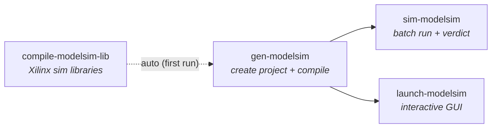

# ModelSim Simulation Flow

This page pulls together everything needed to **simulate** a target's HDL in
ModelSim with the `nihdl` tools: what simulation is for, the settings it needs,
the command sequence, and how it relates to the two
[compile flows](TheoryOfOperation.md#the-two-compile-flows).

Simulation is an **independent branch** of the tool flow. It shares the target's
sources and [generated VHDL](GeneratedVHDL.md) with the Vivado build but does not
require Vivado to run your testbench — only to build the Xilinx simulation
libraries once (see [The Xilinx simulation libraries](#the-xilinx-simulation-libraries)).

## When to use it

Use the ModelSim flow to exercise a testbench against your HDL — the shared
[`hdl-shared`](https://github.com/ni/hdl-shared) host-interface blocks, your
`UserHdl`, or a whole top-level — before committing to a long Vivado compile. It
is the fastest way to verify functional behavior.

## The commands at a glance



| Command | What it does |
| --- | --- |
| [`compile-modelsim-lib`](CommandReference.md#modelsim) | Builds the Xilinx simulation libraries (unisim, secureip, ...) with Vivado's `compile_simlib`. Usually you don't call it directly — `gen-modelsim` auto-runs it the first time. |
| [`gen-modelsim`](CommandReference.md#modelsim) | Renders the [generated VHDL](GeneratedVHDL.md), creates the ModelSim project, patches `modelsim.ini` with the Xilinx library mappings, and compiles all sources with `vcom -autoorder -2008` in one invocation. |
| [`sim-modelsim`](CommandReference.md#modelsim) | Runs the testbench in batch (`vsim -c`) and reports a reliable pass/fail. |
| [`launch-modelsim`](CommandReference.md#modelsim) | Opens the project in the ModelSim GUI (`--batch` for headless). |

## Settings

Configure these in the target's `nihdlsettings.py` (see the
[Settings Reference](SettingsReference.md) for every setter). ModelSim uses its
**own** source lists — it does not fall back to the Vivado `hdl_file_lists`.

**Tools and Xilinx libraries**

| Setter | Purpose |
| --- | --- |
| `set_modelsim_tools_folder(path)` | ModelSim/Questa install root (where `vsim`, `vcom`, `vlib` live). |
| `set_xilinx_sim_lib_folder(path)` | Where the compiled Xilinx sim libraries live — **output** of `compile-modelsim-lib`, **input** to `gen-modelsim`. |
| `add_xilinx_sim_library(name)` | A Xilinx library to build (for example `unisim`). Repeatable; defaults to `unisim` + `secureip`. |
| `set_xilinx_sim_family(name)` | Device family for the libraries (for example `kintexu`). Defaults to `all`, which builds **every** family and can take hours — narrow it. |
| `set_xilinx_sim_language(name)` | `verilog`, `vhdl`, or `all` (default). |

**Project and sources**

| Setter | Purpose |
| --- | --- |
| `set_modelsim_project_folder(path)` | Where the ModelSim project is created (for example `ModelSimProject`). |
| `set_modelsim_top_entity(name)` | The top entity to simulate — usually the **testbench** (for example `tb_UserHdl`). A target with no testbench simply omits this and has nothing to simulate. |
| `add_modelsim_file_list(path)` | A ModelSim source file list. Repeatable. Include the generated VHDL output (for example `objects/GeneratedHDL/PkgNiHdlSettings.vhd`). |
| `add_vhdl2008_file_list(path)` | Files that must be compiled as VHDL-2008. |
| `add_exclude_hdl_file_list(path)` | Drop specific files (resolves same-named collisions across dependency lists). |
| `add_generated_vhdl_template(path)` | Templates rendered by `gen-modelsim` (and `gen-vivado`) so [generated VHDL](GeneratedVHDL.md) stays in lock-step with synthesis. |

## Step by step

From the target folder:

```bash
# 1. (Optional, first time only) build the Xilinx simulation libraries.
#    gen-modelsim auto-runs this, but you can do it up front or on a build agent.
nihdl compile-modelsim-lib

# 2. Create the ModelSim project and compile all sources.
nihdl gen-modelsim --overwrite

# 3a. Run the testbench headlessly and get a pass/fail.
nihdl sim-modelsim

# 3b. …or open it in the GUI to add waves and step interactively.
nihdl launch-modelsim
```

### The Xilinx simulation libraries

`gen-modelsim` needs Xilinx primitives (unisim, secureip, ...) compiled for
ModelSim. `compile-modelsim-lib` wraps Vivado's `compile_simlib` to build them
into `xilinx_sim_lib_folder`, and `gen-modelsim` maps them into the project's
`modelsim.ini`.

- It is **idempotent**: once the requested libraries exist it returns immediately
  (no Vivado needed) unless you pass `--force`.
- The compiled libraries are **simulator- and device-family specific**, so they
  cannot be committed — build them on the simulation machine.
- The **first** `gen-modelsim` launches Vivado to build them and can take several
  minutes; it therefore also needs `vivado_tools_folder`. Later runs skip it.
- `compile_simlib` also builds many bundled Xilinx IP/VIP libraries; failures in
  libraries you did not request (for example the Zynq/Versal processing-system
  VIPs, which ModelSim PE cannot parse) are reported as **warnings** and do not
  fail the command as long as the requested libraries were built.

### How the verdict is determined

`sim-modelsim` runs `vsim -c` against the generated `sim_<entity>.do` script
(override with `--do-file`), forcing the project `modelsim.ini` so the Xilinx
library mappings are honored. It **parses the ModelSim transcript** for testbench
fatals/errors and returns a nonzero exit code on any of them — it does **not**
trust `vsim`'s own exit code. So a return code of `0` is a reliable PASS, which
makes the command safe to gate CI on.

`gen-modelsim` also writes a `load_<entity>.do` (used by `launch-modelsim` to load
the design in the GUI) alongside the `sim_<entity>.do` batch script.

## Validation-only mode (no ModelSim installed)

Set `set_skip_modelsim(True)` (or, in a wrapper settings file, a `--set` override)
to make `gen-modelsim` / `sim-modelsim` **validate** the settings and file lists
and then return success without launching ModelSim. This is how the GitHub-hosted
smoke tests confirm a target's ModelSim project is well-formed on a runner that has
no FPGA tools. See the [Command Reference](CommandReference.md#common-command-notes).

## Related pages

- [Vivado Compile Flow](VivadoCompileFlow.md) — build a bitfile directly in Vivado.
- [LabVIEW FPGA Target and Compile Flow](LabVIEWFpgaTargetFlow.md) — build/install a
  custom target and compile in LabVIEW FPGA.
- [Generated VHDL](GeneratedVHDL.md) — the sources `gen-modelsim` renders and shares
  with synthesis.
- [Command Reference](CommandReference.md) · [Settings Reference](SettingsReference.md).
