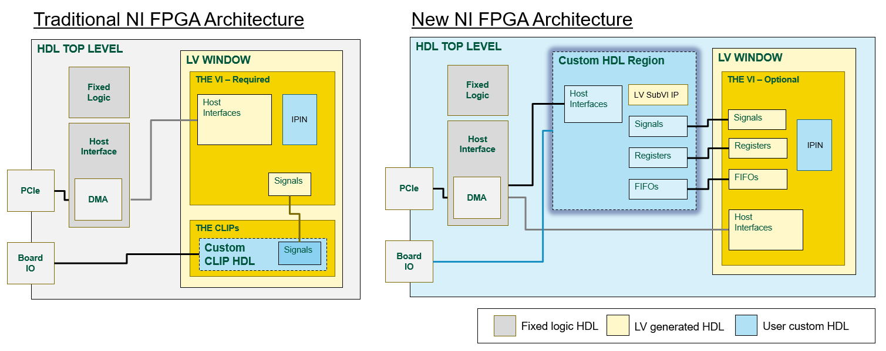
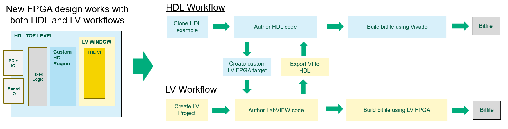
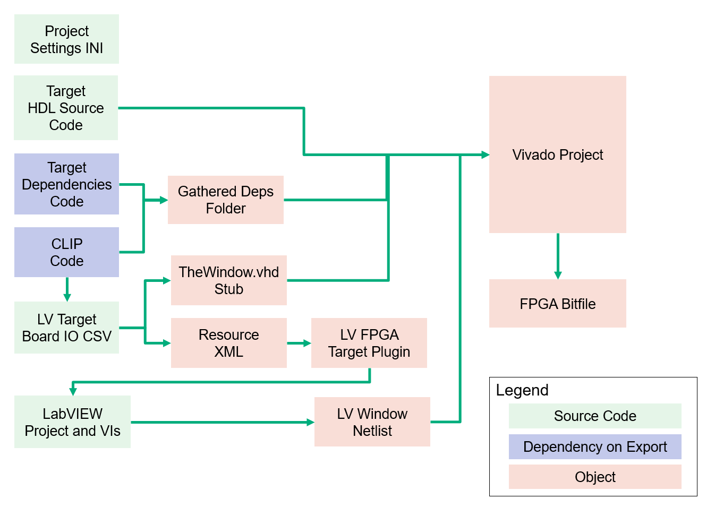

# Theory of Operation

## Architecture

The LabVIEW FPGA HDL tools, along with open-source GitHub repos for FPGA devices, enables a new architecture for user-programmable FPGA.

With the previous FPGA architecture used on LabVIEW FPGA targets, custsom HDL was only accessible through IPIN and CLIP nodes.  There were limitations to what HDL languages, constraints, Xilinx IP and other aspects of digital design could be done within the IPIN and CLIP nodes.  High-performance FPGA applications often require extensive work in the CLIP node to instantiate Xilinx IP cores like multigigabit transcievers.  Having to insert this HDL into the design via a LabVIEW project and VI diagram added difficulty.

The new architecture provides an open-source top-level HDL file for the FPGA.  And rather than shimming HDL in through the LabVIEW window, the user can directly instantiate their HDL customizations in the top-level file.  Additionally, we will have host interfaces available directly in the HDL so that customers do not need to use a LabVIEW FPGA VI to move data to/from the host PC.  For folks who find value in LabVIEW and want to use it, we will provide improved interfaces (regsiters and FIFOs) between the custom HDL and VI diagram.

## Workflows

The new architecture will support both HDL-only and LabVIEW-only workflows.  A user will be able to start with the HDL example for a FPGA board and use HDL to extend the design.  Then they can use Vivado to build the bitfile.  Or a user may stick with the traditional LabVIEW FPGA workflow.  

We will also support hybrid HDL-LV workflows where the user can create an HDL-customized LabVIEW FPGA target for further extension in LabVIEW.  Or they may author code in LabVIEW and export that to a netlist that can be brought into the HDL workflow and Vivado tools.

| Feature | Tech Preview | Future |
|:---------|:-------------:|:--------:|
| Supported targets | PXIe-7903 only | More targets! |
| Command-line tools to automate Vivado and LabVIEW integration | ✓ | ✓ |
| Command-line tools to migrate CLIP code into new HDL architecture | ✓ | ✓ |
| Custom LabVIEW FPGA target plugin | ✓ | ✓ |
| Import LabVIEW top-level VI netlist into HDL | ✓ | ✓ |
| Build bitfile using LabVIEW FPGA compile tools | ✓ | ✓ |
| Build bitfile using Vivado tools directly | ✓ | ✓ |
| HDL-to-LV signals | ✓ | ✓ |
| HDL-to-LV registers | X | ✓ |
| HDL-to-LV FIFOs | X | ✓ |
| HDL-to-Host registers | X | ✓ |
| HDL-to-Host FIFOs | X | ✓ |

Today, some of these features are available through the Tech Preview.  More will come later!

The workflows we are supporting today in the Tech Preview require the use of LabVIEW FPGA to communicate between the FPGA and host PC.

## LabVIEW FPGA HDL Tools

The LabVIEW FPGA HDL Tools are a set of command line utilitites that move, generate and process files to aid in the creation of a customized FPGA design.  You can type nihdl --help to get a list of the commands:

* create-lvbitx   Create LabVIEW FPGA bitfile from Vivado output
* create-project  Create or update Vivado project
* extract-deps    Extract dependency ZIP files (run from 'targets' folder)
* gen-target      Generate LabVIEW FPGA target support files
* get-window      Extract window netlist from Vivado project
* install-target  Install LabVIEW FPGA target support files
* launch-vivado   Launch Vivado with the current project
* migrate-clip    Migrate CLIP files for FlexRIO custom devices

These commands are configured in the projectesttings.ini file.

The projectsettings.ini file has multiple sections that map to the specific commands:
* GeneralSettings
    * Used by multiple commands
* VivadoProjectSettings
    * create-project
    * launch-vivado
* LVFPGATargetSettings
    * gen-target
    * install-target
* CLIPMigrationSettings
    * migrate-clip
* LVWindowNetlistSettings
    * get-window

The sections of the configuration file enables the commands to operate independently.  You will find that TheWindowFolder is specified in both LVWindowNetlistSettings and VivadoProjectSettings.  This is because TheWindowFolder used as an output of the get-window command as well as an input to the create-project command.  Typically, you would set both instances of TheWindowFolder to the same thing.  But this design allows you to run the commands independently and manage the folders however you want.

The intent is that these commands can be integrated into the user's custom CI/CD and build processes.

The tools operate on source code and generate outputs that can either be pulled back into source code control or treated as an object (and not put into source code control).  The objects go into an objects folder that is ignored by GitHub.

Here is a map of how this is intended to operate:

In addition to source code from GitHub, the HDL designs depend on exports from NI components that are delivered through a zip file attached as a GitHub release artifact.