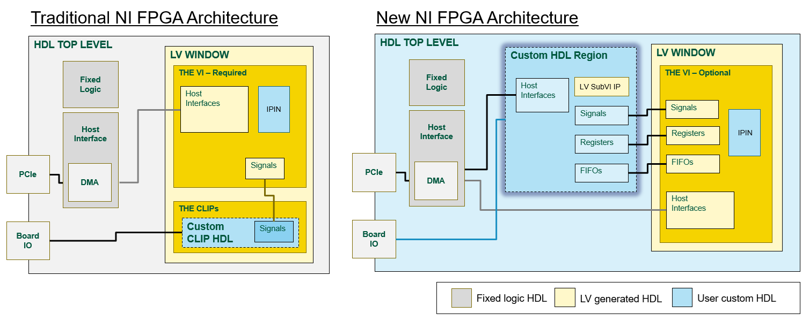
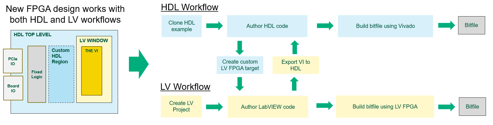
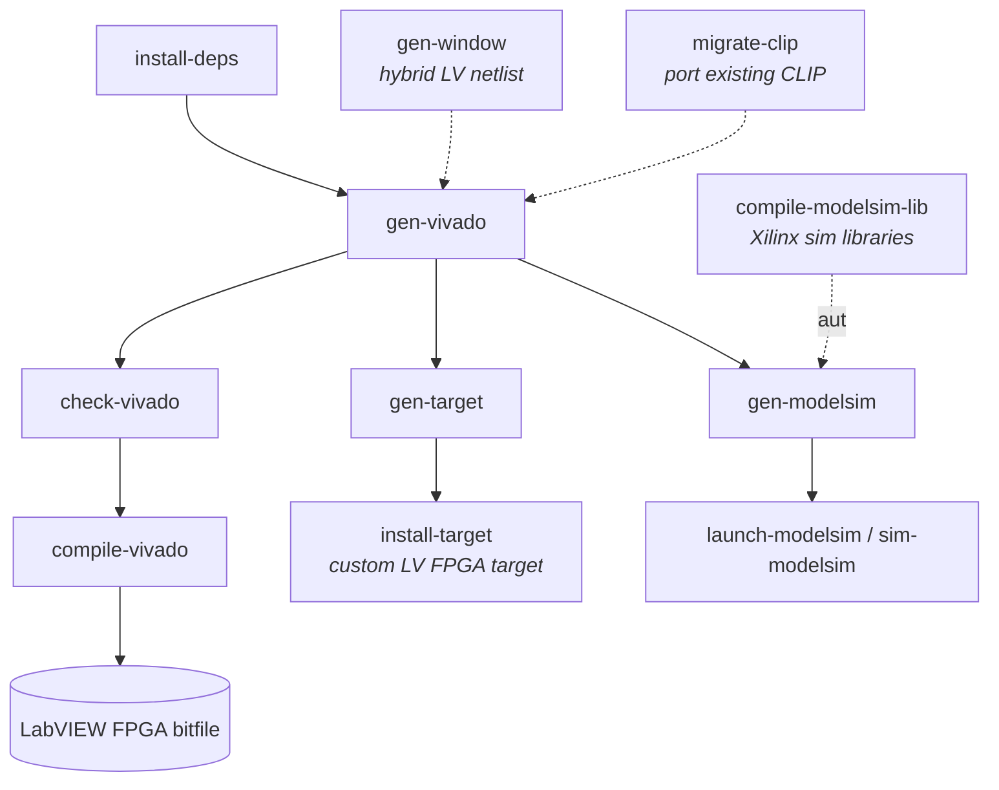

# Theory of Operation

## Architecture

The LabVIEW FPGA HDL tools, along with open-source GitHub repos for FPGA devices, enables a new architecture for user-programmable FPGA.

With the previous FPGA architecture used on LabVIEW FPGA targets, custom HDL was only accessible through IPIN and CLIP nodes.  There were limitations to what HDL languages, constraints, Xilinx IP and other aspects of digital design could be done within the IPIN and CLIP nodes.  High-performance FPGA applications often require extensive work in the CLIP node to instantiate Xilinx IP cores like multigigabit transcievers.  Having to insert this HDL into the design via a LabVIEW project and VI diagram added difficulty.

The new architecture provides an open-source top-level HDL file for the FPGA.  And rather than shimming HDL in through the LabVIEW window, the user can directly instantiate their HDL customizations in the top-level file.  Additionally, we will have host interfaces available directly in the HDL so that customers do not need to use a LabVIEW FPGA VI to move data to/from the host PC.  For folks who find value in LabVIEW and want to use it, we will provide improved interfaces (registers and FIFOs) between the custom HDL and VI diagram.

## The two compile flows

Every design starts the same way: you begin with the open-source top-level HDL for
your FPGA board and extend it with the `nihdl` tools. From there, there are two ways
to turn that design into a LabVIEW FPGA bitfile. Both paths ultimately run Vivado —
they differ in **what compiles the bitfile** and **where you finish the design**.

### Vivado compile flow

You extend the design in HDL and compile the bitfile **directly in Vivado**.
`nihdl gen-vivado` assembles a Vivado project from your HDL sources and constraints,
and `nihdl compile-vivado` (or Vivado itself) produces the bitfile. The host
communicates with your logic over registers and DMA FIFOs through the NI-RIO driver —
no LabVIEW required. Choose this when your design is HDL and you want to drive Vivado
yourself.

### LabVIEW FPGA compile flow

You package your HDL as a **custom LabVIEW FPGA target** and finish the design **in
LabVIEW FPGA**. `nihdl gen-target` and `nihdl install-target` build and install the
target plugin; you then write a VI against it and let LabVIEW FPGA compile the
bitfile — which invokes Vivado under the hood. Choose this when you want to combine
custom HDL with a LabVIEW FPGA VI and use the standard LabVIEW FPGA bitfile-generation
experience.

> **In one line:** in the *Vivado compile flow* **you** drive Vivado; in the
> *LabVIEW FPGA compile flow* **LabVIEW FPGA** drives Vivado for you. After the first
> mention, these are referred to as the **Vivado flow** and the **LabVIEW FPGA flow**.

### Bridging the two: LabVIEW window netlists

You can also author part of the design in LabVIEW, export it as a netlist
(`gen-window`), and bring that netlist into the **Vivado compile flow**. This hybrid
input lets a LabVIEW-authored window ride along inside an HDL/Vivado build. See
[The Window Netlist and Constraints Processing](WindowNetlistAndConstraints.md) for
how the netlist is produced and consumed, and how the window's XDC constraints are
processed for each flow.

## The LabVIEW FPGA HDL Tools

The `nihdl` command-line tools move, generate, and process the files that turn a
top-level HDL design into a LabVIEW FPGA bitfile (and, optionally, a custom
LabVIEW FPGA target). They are designed so each step can run independently and be
wired into a custom CI/CD or build process.

This document covers *why* the tools exist and *how the pieces relate*. For the
operational details, see:

- [Command Reference](CommandReference.md) — the commands, their options, and the build flow.
- [Settings Reference](SettingsReference.md) — how a target is configured via `nihdlsettings.py`.

### How the commands relate

The commands form a pipeline from dependencies to a bitfile. The Vivado project
is the hub: it is generated from your HDL sources, checked, and then compiled.
Building a hybrid LabVIEW FPGA target and simulating in ModelSim branch off from
the same configured target.

`gen-vivado` automatically generates the design's VHDL and XDC along the way, and
`compile-vivado` produces the LabVIEW FPGA bitfile at the end. The
[Command Reference](CommandReference.md) describes exactly which commands invoke
which.

### Independent commands connected by files

Each command reads and writes files; the commands are not coupled to one another
except through those files. This is what lets you run any step on its own and
manage the folders however your build process prefers.

A good example is the LabVIEW Window netlist: it is an *output* of `gen-window`
and an *input* to `gen-vivado`. You typically point both at the same folder, but
because they are configured independently you are free to stage or relocate the
files in between.

### Sources versus objects

The tools operate on source code and generate outputs that can either be pulled
back into source control or treated as build objects that are not checked in.
Generated objects go into an objects folder that is ignored by GitHub. This keeps
the repository to authored sources while still allowing fully reproducible
generated artifacts.

In addition to source code from GitHub, the HDL designs depend on exports from NI
components that are delivered through a zip file attached as a GitHub release
artifact.
