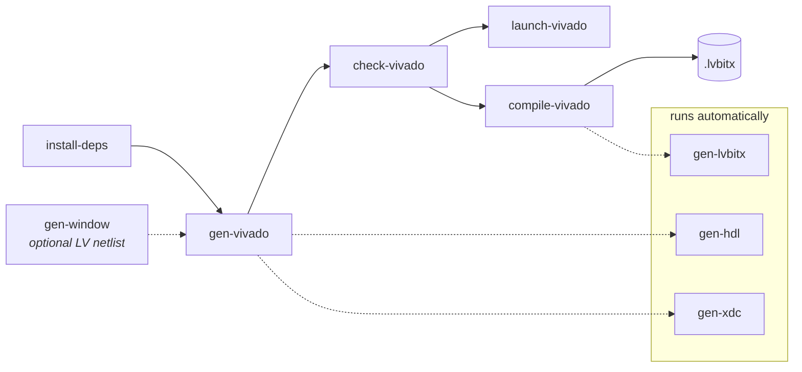

# Vivado Compile Flow

This page pulls together the **Vivado compile flow**: you extend the open-source
top-level HDL for your board, assemble a Vivado project with `nihdl`, and compile a
LabVIEW FPGA bitfile **directly in Vivado** — no LabVIEW FPGA VI required. The host
talks to your logic over registers and DMA FIFOs through the NI-RIO driver.

For the conceptual difference between this and the
[LabVIEW FPGA target/compile flow](LabVIEWFpgaTargetFlow.md), see
[Theory of Operation → The two compile flows](TheoryOfOperation.md#the-two-compile-flows).

## When to use it

Choose the Vivado compile flow when your design is HDL and you want to drive Vivado
yourself — full control over synthesis, implementation, Xilinx IP, and timing. You
can also bring a **LabVIEW-authored window** into this flow as a netlist (see
[Bridging in a LabVIEW window](#bridging-in-a-labview-window)).

## The commands at a glance



| Command | What it does |
| --- | --- |
| [`install-deps`](CommandReference.md#workspace-setup) | Clone the dependency repos named in `dependencies.toml` into `deps/`. |
| [`gen-vivado`](CommandReference.md#vivado-compile-flow) | Assemble (or `--update`) the Vivado project from the file lists and constraints. Auto-runs `gen-hdl` (renders [generated VHDL](GeneratedVHDL.md)) and `gen-xdc` (processes constraints). |
| [`check-vivado`](CommandReference.md#vivado-compile-flow) | Fast RTL elaboration to catch syntax/hierarchy errors without a full compile. |
| [`launch-vivado`](CommandReference.md#vivado-compile-flow) | Open the generated project in the Vivado GUI. |
| [`compile-vivado`](CommandReference.md#vivado-compile-flow) | Run synthesis → implementation → bitstream, then auto-run `gen-lvbitx` to package a `.lvbitx`. |

## Settings

Configure these in the target's `nihdlsettings.py` (see the
[Settings Reference](SettingsReference.md) for every setter).

**Tools and project**

| Setter | Purpose |
| --- | --- |
| `set_vivado_tools_folder(path)` | Vivado install root (contains `bin/vivado`). |
| `set_vivado_tcl_scripts_folder(path)` | Folder of Vivado TCL Mako templates the tools drive. |
| `set_vivado_top_entity(name)` | Top-level entity/module (for example `MacallanTop`). |
| `set_fpga_part(value)` | FPGA part string (for example `xcku040-ffva1156-2-e`). |
| `set_vivado_project_folder(path)` | Where the project is created (for example `VivadoProject`). |

**Sources**

| Setter | Purpose |
| --- | --- |
| `add_hdl_file_list(path)` | An HDL source file list. Repeatable — typically the base-target deps, this target's `vivadoprojectsources.txt`, and any shared HDL. |
| `add_vhdl2008_file_list(path)` | Files compiled with the `-2008` flag. |
| `add_exclude_hdl_file_list(path)` | Drop specific files to resolve same-named collisions across dependency lists. |
| `add_generated_vhdl_template(path)` | Templates rendered by `gen-hdl`/`gen-vivado`. See [Generated VHDL](GeneratedVHDL.md). |

**Constraints** (see [Window Netlist and Constraints](WindowNetlistAndConstraints.md) for the full processing model)

| Setter | Purpose |
| --- | --- |
| `set_constraints_template(path)` | The base target's `constraints.xdc` template (so you uptake base updates). |
| `add_custom_constraints(path, order)` | Your additional XDC, concatenated in ascending `order`. |
| `add_vivado_project_constraints(path)` | The processed output (`objects/xdc/constraints.xdc`) plus the base target's placement constraints. |
| `set_lv_window_netlist_folder(path)` | Optional — the folder of `gen-window` output, when bridging in a LabVIEW window. |

## Step by step

From the target folder:

```bash
# 1. Pull the dependency repos (first time / when versions change).
nihdl install-deps

# 2. Generate the Vivado project (also renders VHDL + processes XDC).
nihdl gen-vivado --overwrite

# 3. Quick sanity check of RTL syntax/hierarchy.
nihdl check-vivado

# 4a. Open in Vivado to work interactively…
nihdl launch-vivado

# 4b. …or compile straight through to a .lvbitx.
nihdl compile-vivado
```

### From bitstream to `.lvbitx`

`compile-vivado` runs the Vivado compile to bitstream and then auto-runs
`gen-lvbitx`, which packages Vivado's implementation output into a LabVIEW FPGA
bitfile (`.lvbitx`). `gen-lvbitx` locates `createBitfile.exe` from your LabVIEW
install — by default it auto-discovers the latest installed LabVIEW (2023–2030); set
`set_labview_path(...)` to pin a specific one. You can also run `gen-lvbitx` on its
own from the `VivadoProject/<project>.runs/impl_1` folder.

### Bridging in a LabVIEW window

You can author part of the design as a LabVIEW FPGA VI, export it as a *Vivado
Project Export*, and run [`gen-window`](CommandReference.md#hdl-tools) to extract a
**Verilog netlist** of that window plus its constraints. Point
`set_lv_window_netlist_folder(...)` at that output and `gen-vivado` integrates it.
This is what pulls a LabVIEW-authored window into an otherwise all-HDL Vivado build.
See [The Window Netlist and Constraints Processing](WindowNetlistAndConstraints.md).

## Validation-only mode (no Vivado installed)

Set `set_skip_vivado(True)` to make `gen-vivado` / `check-vivado` / `compile-vivado`
**validate** settings, file lists, and constraints — generating the project files and
TCL — without launching Vivado. This is how the GitHub-hosted smoke tests confirm a
target is well-formed on a runner with no FPGA tools. See the
[Command Reference](CommandReference.md#common-command-notes).

## Related pages

- [LabVIEW FPGA Target and Compile Flow](LabVIEWFpgaTargetFlow.md) — the other way to
  reach a bitfile, finishing the design in LabVIEW FPGA.
- [ModelSim Simulation Flow](ModelSimSimulationFlow.md) — verify behavior before you
  compile.
- [Generated VHDL](GeneratedVHDL.md) · [Window Netlist and Constraints](WindowNetlistAndConstraints.md).
- [Command Reference](CommandReference.md) · [Settings Reference](SettingsReference.md).
